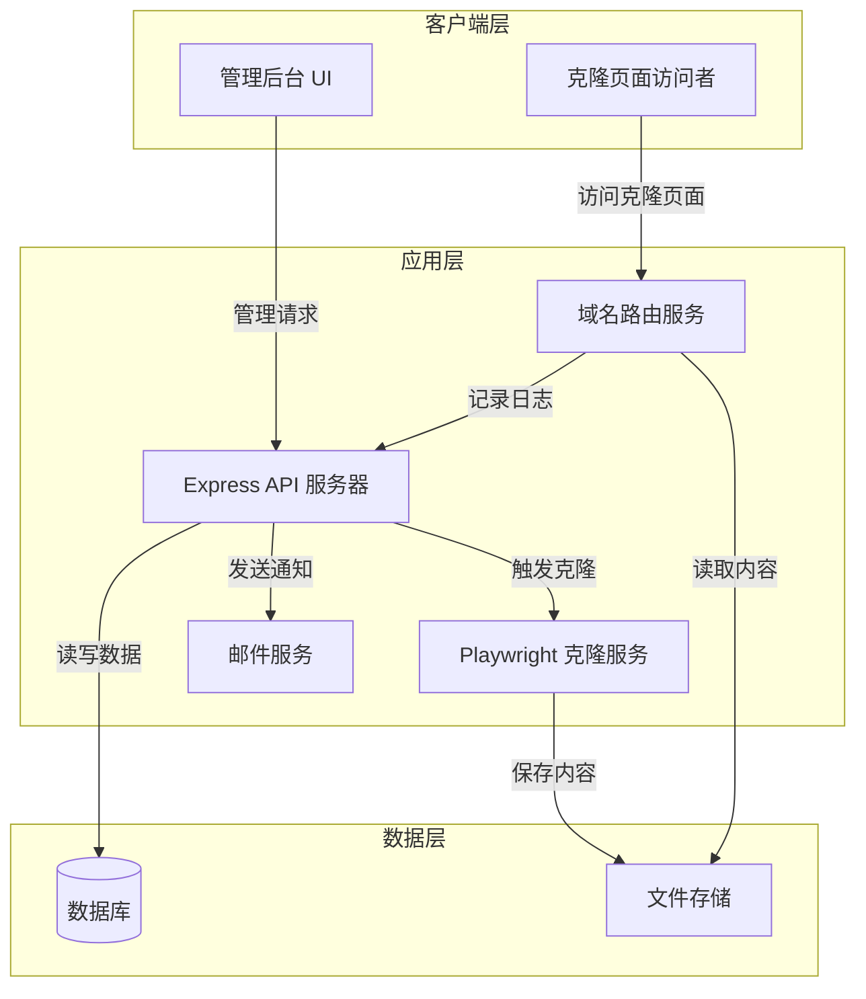

# 设计文档

## 概述

克隆管理系统是一个基于 Web 的后台管理平台，使用 Node.js/Express 构建后端 API，使用 Playwright 进行网页克隆，通过动态域名路由实现多域名访问克隆页面。系统采用前后端分离架构，后端提供 RESTful API，前端使用现代框架（React/Vue）构建管理界面。

核心功能包括：
- 克隆项目的创建、管理和状态跟踪
- 基于 Playwright 的网页内容克隆
- 动态域名路由和反向代理
- 访问日志记录和统计分析
- 系统配置和邮件通知

## 架构

### 系统架构图



### 技术栈

**后端:**
- Node.js + Express.js (API 服务器)
- Playwright (浏览器自动化和网页克隆)
- http-proxy-middleware (反向代理)
- Nodemailer (邮件发送)

**数据库:**
- PostgreSQL 或 MySQL (关系型数据库，存储项目、日志、配置)

**前端:**
- React 或 Vue.js (管理界面)
- Axios (HTTP 客户端)
- Chart.js 或 ECharts (数据可视化)

**部署:**
- Docker (容器化部署)
- Nginx (可选，作为前置反向代理)

## 组件和接口

### 1. API 服务器 (Express API Server)

**职责:**
- 提供 RESTful API 接口
- 处理用户认证和授权
- 管理克隆项目的 CRUD 操作
- 协调克隆服务和邮件服务
- 提供访问日志查询接口

**主要接口:**

```typescript
// 认证接口
POST /api/auth/login
POST /api/auth/logout
GET /api/auth/me

// 克隆项目接口
GET /api/projects
POST /api/projects
GET /api/projects/:id
PUT /api/projects/:id
DELETE /api/projects/:id
POST /api/projects/:id/clone
POST /api/projects/:id/retry

// 访问日志接口
GET /api/logs
GET /api/logs/stats
GET /api/logs/export

// 系统配置接口
GET /api/config
PUT /api/config
POST /api/config/email/test

// 功能开关接口
GET /api/features
PUT /api/features/:name
```

### 2. 克隆服务 (Clone Service)

**职责:**
- 使用 Playwright 访问目标网页
- 提取 HTML、CSS、JavaScript 和资源文件
- 处理动态内容和 JavaScript 渲染
- 保存克隆内容到文件系统
- 更新克隆项目状态

**核心方法:**

```typescript
interface CloneService {
  // 执行克隆操作
  cloneWebsite(projectId: string, sourceUrl: string): Promise<CloneResult>;
  
  // 提取页面内容
  extractPageContent(page: Page): Promise<PageContent>;
  
  // 下载资源文件
  downloadResources(page: Page, baseUrl: string): Promise<Resource[]>;
  
  // 保存克隆内容
  saveClonedContent(projectId: string, content: PageContent): Promise<string>;
  
  // 处理相对路径
  rewriteUrls(html: string, baseUrl: string): string;
}

interface CloneResult {
  success: boolean;
  projectId: string;
  contentPath: string;
  error?: string;
}

interface PageContent {
  html: string;
  css: string[];
  scripts: string[];
  resources: Resource[];
}

interface Resource {
  type: 'image' | 'font' | 'media';
  url: string;
  localPath: string;
}
```

### 3. 域名路由服务 (Domain Routing Service)

**职责:**
- 监听 HTTP 请求
- 根据请求域名查找对应的克隆项目
- 提供克隆页面内容
- 记录访问日志

**核心方法:**

```typescript
interface DomainRoutingService {
  // 处理域名请求
  handleRequest(req: Request, res: Response): Promise<void>;
  
  // 查找域名对应的项目
  findProjectByDomain(domain: string): Promise<Project | null>;
  
  // 提供克隆内容
  serveClonedContent(projectId: string, res: Response): Promise<void>;
  
  // 记录访问日志
  logAccess(domain: string, ip: string, userAgent: string): Promise<void>;
}
```

### 4. 邮件服务 (Email Service)

**职责:**
- 发送邮件通知
- 管理邮件模板
- 验证 SMTP 配置

**核心方法:**

```typescript
interface EmailService {
  // 发送邮件
  sendEmail(to: string, subject: string, body: string): Promise<boolean>;
  
  // 发送克隆完成通知
  sendCloneCompleteNotification(project: Project): Promise<void>;
  
  // 发送克隆失败通知
  sendCloneFailureNotification(project: Project, error: string): Promise<void>;
  
  // 测试 SMTP 连接
  testConnection(config: EmailConfig): Promise<boolean>;
}

interface EmailConfig {
  host: string;
  port: number;
  secure: boolean;
  auth: {
    user: string;
    pass: string;
  };
}
```

### 5. 日志服务 (Logging Service)

**职责:**
- 记录访问日志
- 提供日志查询和统计
- 清理过期日志

**核心方法:**

```typescript
interface LoggingService {
  // 记录访问
  logAccess(log: AccessLog): Promise<void>;
  
  // 查询日志
  queryLogs(filter: LogFilter): Promise<AccessLog[]>;
  
  // 获取统计数据
  getStats(filter: LogFilter): Promise<LogStats>;
  
  // 清理过期日志
  cleanupOldLogs(retentionDays: number): Promise<number>;
}

interface AccessLog {
  id: string;
  projectId: string;
  domain: string;
  ip: string;
  userAgent: string;
  timestamp: Date;
  path: string;
  referer?: string;
}

interface LogFilter {
  projectId?: string;
  domain?: string;
  startDate?: Date;
  endDate?: Date;
  limit?: number;
  offset?: number;
}

interface LogStats {
  totalVisits: number;
  uniqueVisitors: number;
  visitsByDomain: Map<string, number>;
  visitsByDate: Map<string, number>;
  topReferers: Array<{ referer: string; count: number }>;
}
```

## 数据模型

### 数据库表结构

```sql
-- 克隆项目表
CREATE TABLE projects (
  id VARCHAR(36) PRIMARY KEY,
  name VARCHAR(255) NOT NULL,
  source_url TEXT,
  source_screenshot TEXT,
  domain VARCHAR(255) UNIQUE NOT NULL,
  status VARCHAR(50) NOT NULL, -- 'pending', 'cloning', 'completed', 'failed'
  content_path TEXT,
  error_message TEXT,
  created_at TIMESTAMP DEFAULT CURRENT_TIMESTAMP,
  updated_at TIMESTAMP DEFAULT CURRENT_TIMESTAMP ON UPDATE CURRENT_TIMESTAMP,
  INDEX idx_domain (domain),
  INDEX idx_status (status)
);

-- 访问日志表
CREATE TABLE access_logs (
  id BIGINT AUTO_INCREMENT PRIMARY KEY,
  project_id VARCHAR(36) NOT NULL,
  domain VARCHAR(255) NOT NULL,
  ip VARCHAR(45) NOT NULL,
  user_agent TEXT,
  path VARCHAR(500),
  referer TEXT,
  timestamp TIMESTAMP DEFAULT CURRENT_TIMESTAMP,
  INDEX idx_project_id (project_id),
  INDEX idx_domain (domain),
  INDEX idx_timestamp (timestamp),
  FOREIGN KEY (project_id) REFERENCES projects(id) ON DELETE CASCADE
);

-- 系统配置表
CREATE TABLE system_config (
  key VARCHAR(100) PRIMARY KEY,
  value TEXT NOT NULL,
  description TEXT,
  updated_at TIMESTAMP DEFAULT CURRENT_TIMESTAMP ON UPDATE CURRENT_TIMESTAMP
);

-- 功能开关表
CREATE TABLE feature_flags (
  name VARCHAR(100) PRIMARY KEY,
  enabled BOOLEAN DEFAULT TRUE,
  description TEXT,
  updated_at TIMESTAMP DEFAULT CURRENT_TIMESTAMP ON UPDATE CURRENT_TIMESTAMP
);

-- 管理员用户表
CREATE TABLE admin_users (
  id VARCHAR(36) PRIMARY KEY,
  username VARCHAR(100) UNIQUE NOT NULL,
  password_hash VARCHAR(255) NOT NULL,
  email VARCHAR(255),
  created_at TIMESTAMP DEFAULT CURRENT_TIMESTAMP,
  last_login TIMESTAMP,
  INDEX idx_username (username)
);
```

### TypeScript 数据模型

```typescript
interface Project {
  id: string;
  name: string;
  sourceUrl?: string;
  sourceScreenshot?: string;
  domain: string;
  status: ProjectStatus;
  contentPath?: string;
  errorMessage?: string;
  createdAt: Date;
  updatedAt: Date;
}

enum ProjectStatus {
  PENDING = 'pending',
  CLONING = 'cloning',
  COMPLETED = 'completed',
  FAILED = 'failed'
}

interface SystemConfig {
  emailEnabled: boolean;
  emailHost: string;
  emailPort: number;
  emailSecure: boolean;
  emailUser: string;
  emailPassword: string;
  logRetentionDays: number;
  maxCloneTimeout: number;
}

interface FeatureFlag {
  name: string;
  enabled: boolean;
  description: string;
}

interface AdminUser {
  id: string;
  username: string;
  passwordHash: string;
  email?: string;
  createdAt: Date;
  lastLogin?: Date;
}
```

